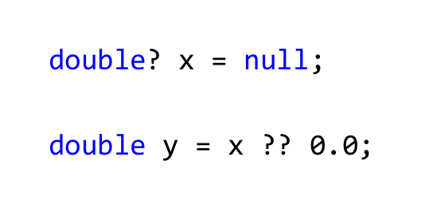
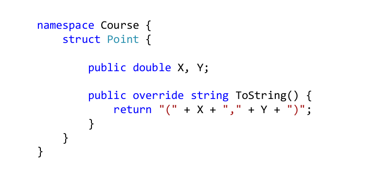
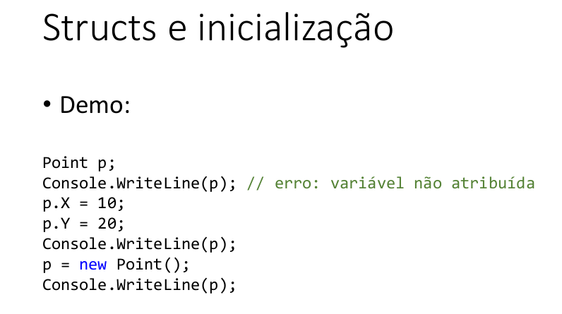
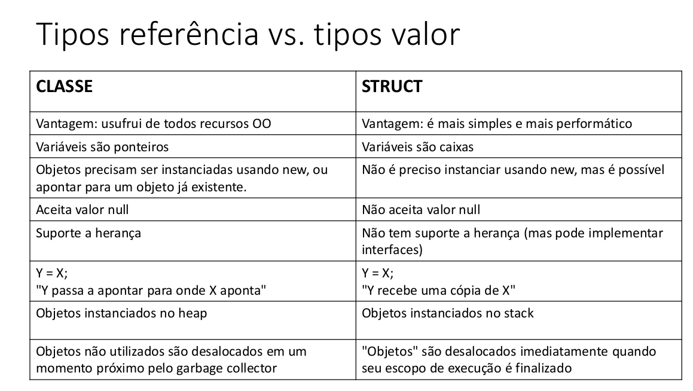

# Classes, Métodos, Construtores, This, Sobrecarga e Encapsulamento

## Construtor

-   É uma operação especial da classe, que é executada no momento da
    instanciação do objeto

    ### Usos comuns:

-   Iniciar valores dos atributos
-   Permitir ou obrigar que o objeto receba dados / dependências no momento de sua
    instanciação (injeção de dependência)

    ### Mais sobre construtores

-   Se um construtor customizado não for especificado, a classe disponibiliza o
    construtor padrão:
-   Produto p = new Produto();
-   É possível especificar mais de um construtor na mesma classe (sobrecarga)

## Sobrecarga

-   É um recurso que uma classe possui de oferecer mais de uma
    operação com o mesmo nome, porém com diferentes listas de
    parâmetros.

## Palavra this

-   É uma referência para o próprio objeto

    ### Usos comuns:

    -   Diferenciar atributos de variáveis locais (Java)
    -   Referenciar outro construtor em um construtor
    -   Passar o próprio objeto como argumento na chamada de um método ou construtor

## Encapsulamento

-   É um princípio que consiste em esconder detalhes de implementação
    de um componente, expondo apenas operações seguras e que o mantenha
    em um estado consistente.
-   Regra de ouro: o objeto deve sempre estar em um estado consistente, e a
    própria classe deve garantir isso.

    ### Opção 1: implementação manual

    -   Todo atributo é definido como private
    -   Implementa-se métodos Get e Set para cada atributo, conforme regras de negócio
    -   Nota: não é usual na plataforma C#

## Properties

-   São definições de métodos encapsulados, porém expondo uma
    sintaxe similar à de atributos e não de métodos
-   https://docs.microsoft.com/pt-br/dotnet/csharp/programming-guide/classes-and-structs/properties
-   Uma propriedade é um membro que oferece um mecanismo flexível para ler,
    gravar ou calcular o valor de um campo particular. As propriedades podem ser
    usadas como se fossem atributos públicos, mas na verdade elas são métodos
    especiais chamados "acessadores". Isso permite que os dados sejam
    acessados facilmente e ainda ajuda a promover a segurança e a flexibilidade
    dos métodos.

## Auto Properties

### Propriedades autoimplementadas

-   É uma forma simplificada de se declarar propriedades que não
    necessitam lógicas particulares para as operações get e set.
-   public double Price { get; private set; }

## Ordem sugerida para implementação de membros

-   Atributos privados
-   Propriedades aut´oimplementadas
-   Construtores
-   Propriedades customizadas
-   Outros métodos da classe

## Modificadores e acesso

### Classes

#### Acesso por qualquer classe

-   public class Pro´duct

#### Acesso somente dentro do assembly

-   internal class Product
-   class Product

#### Acesso somente pela classe-mãe

-   private class Product
-   Nota: classe aninhada, por padrão, é private

# Comportamento de memória, Arrays e Listas

## Tipos referência vs. tipos valor

### Classes são tipos referência

-   Variáveis cujo tipo são classes não devem ser entendidas como caixas, mas sim
    “tentáculos” (ponteiros) para caixas
-   Tipos referência aceitam o valor "null", que indica que a variável aponta pra ninguém.

### Structs são tipos valor

-   A linguagem C# possui também tipos valor, que são os "structs". Structs são CAIXAS e
    não ponteiros.

#### É possível criar seus próprios structs

### Valores padrão

#### Quando alocamos (new) qualquer tipo estruturado (classe, struct, array), são atribuídos valores padrão aos seus elementos

-   números: 0
-   bool: False
-   char: caractere código 0
-   objeto: null

#### Lembrando: uma variável apenas declarada, mas não instanciada, inicia em estado "não atribuída", e o próprio compilador não permite que ela seja acessada.

## Desalocação de memória - garbage collector e escopo local

### Garbage collector

-   É um processo que automatiza o gerenciamento de memória de um
    programa em execução
-   O garbage collector monitora os objetos alocados dinamicamente
    pelo programa (no heap), desalocando aqueles que não estão mais
    sendo utilizados.

#### Resumo

-   Objetos alocados dinamicamente, quando não possuem mais referência para eles, serão desalocados pelo garbage collector
-   Variáveis locais são desalocadas imediatamente assim que seu escopo local sai de execução (desalocação por escopo)

### Nullable

-   É um recurso de C# para que dados de tipo valor (structs) possam receber o valor null

#### Uso comum:

-   Campos de banco de dados que podem valer nulo (data de nascimento, algum valor numérico, etc.).
-   Dados e parâmetros opcionais.
